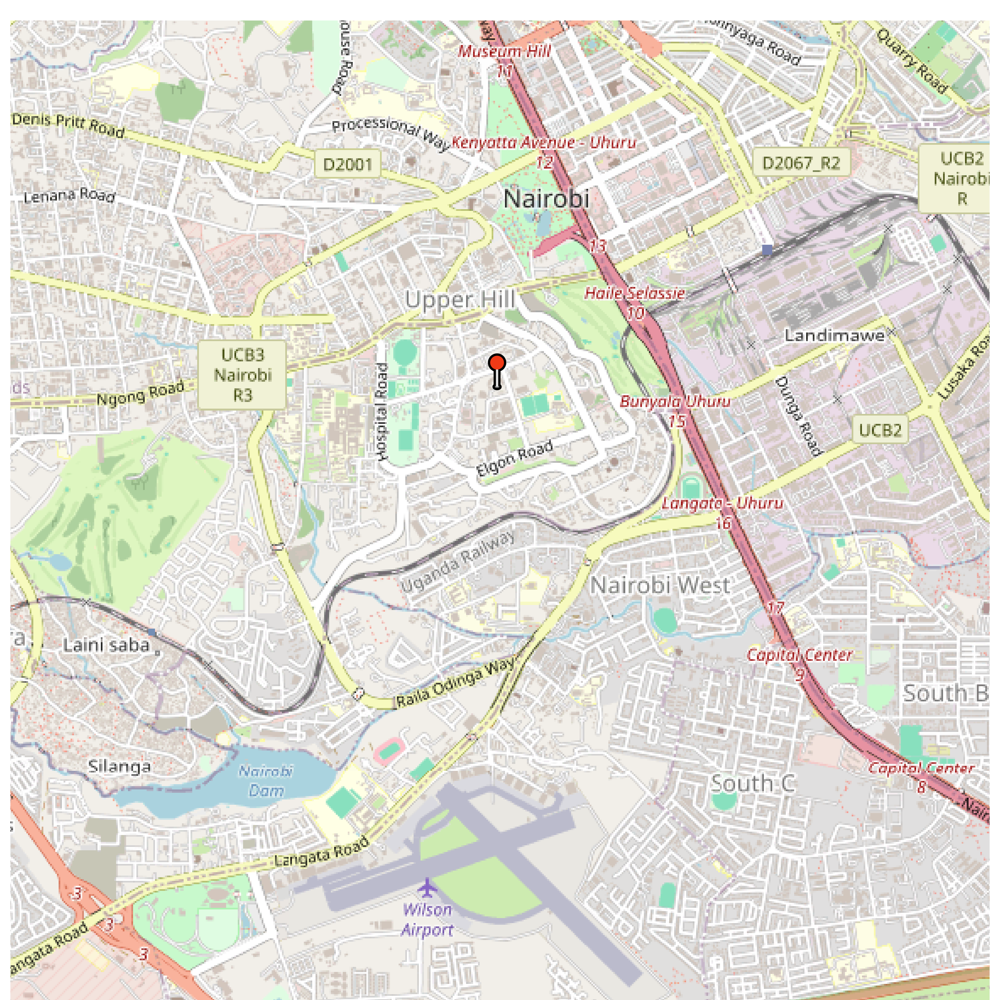

# Kenyan Data Visualizations

This repository contains a collection of data visualizations about various topics related to the Kenyan continent. The visualizations have been created using various tools and software, and they are meant to provide a concise explanation of various phenomena to policymakers and the general public.

***NOTE: Direct links to the code used to produce the image(s) below will be provided ASAP (if not provided already).***

**UPDATE: REPO IS BEING REARRANGED SO LINKS BELOW WILL NOT BE FUNCTIONAL UNTIL FURTHER NOTICE (05 June 2025)**

## Example visualizations

### 1) Land Prices in Kenya (Upper Hill Area)

[Code](sub_pro_2_land_prices_kenya/r_scripts/hass_land_prices_1.R)

### 2) Unlabeled Map of Kenya

[Code](sub_pro_3_disturb_danger_kenya/r_scripts/danger_disturb.R)

### 3) Composition of the National Assembly of Kenya in August 2022

[Code](sub_pro_6_national_assembly_kenya/r_scripts/national_assembly_1.R)

